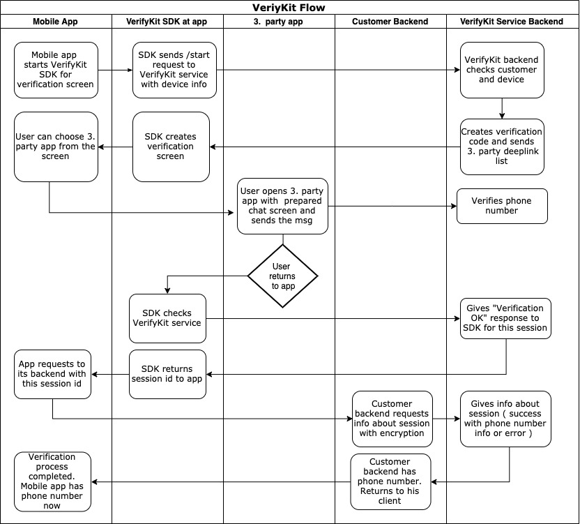

# VerifyKit
[](#installation)
 

[](#swift-versions-support)
[](https://cocoapods.org/pods/VerifyKit)
[](https://github.com/Carthage/Carthage)

VerifyKit is the next gen phone number validation system. Users can easily verify their  phone numbers without the need of entering phone number or a pin code.

## How It Works?

1. Register your app at https://www.verifykit.com and get your client keys and server key. 
2. Add VerifyKit SDK to your app
3. Configure and start VerifyKit SDK
4. When verification is complete, send ```sessionId``` which VeriyfKit SDK gives you to your backend service
5. At your server side, get user's phone number from VerifyKit service wtih ```serverKey``` and ```sessionId```. You can check [Backend Integration](#backend-integration)



## Security

```ServerKey``` is used for getting info from VerifyKit service.
Please keep ```ServerKey``` safe. Do not include it in your client's code base.

## Requirements

 - Xcode 12.0+
 - iOS 11.0+

## Installation

#### CocoaPods
You can install framework via [CocoaPods](https://cocoapods.org/pods/VerifyKit).

```bash
pod 'VerifyKit'
```
<!--- ## Manual Installation

Or you can [click here](https://verifykit.com/framework/verifykit-sdk-ios-001.zip) to download the framework and add the files with drag and drop.

If you choose to use the SDK manually, after you added the files to your project, you need to add both frameworks to ```Frameworks, Libraries, and Embedded Content``` panel in your Project's general settings, then set ```Embed``` option as ```Embed & Sign```. -->

## Configure Info.plist

To successfully use the framework, you need to add ```VerifyKitKey``` and ```VerifyKitSecret``` to your plist file. This step is mandatory.

To open a third party messaging app from your application, you need to add their url schemes to ```LSApplicationQueriesSchemes``` key in your plist file. After iOS14, to open Associated Domain URLS in a device which uses a different default browser then Safari, you also need to add ```https``` as url scheme.

Open your Info.plist as source code and insert the following XML snippet into the body of your file just before the final ```</dict>``` element.

```
<key>VerifyKitKey</key>
<string>{your-verifykit-key}</string>
<key>VerifyKitSecret</key>
<string>{your-verifykit-secret-key}</string>
<key>LSApplicationQueriesSchemes</key>
<array>
  <string>whatsapp</string>
  <string>telegram</string>
  <string>viber</string>
  <string>https</string>
</array>
```

##

After a successful validation with a third party messaging app, the user needs to return to main app. If your application has an Associated Domain, we can add a deeplink to our message for easy and quick redirect.

If you support Associated Domains, please fill out **Deeplink** field at VerifyKit portal with your domain.

If you don't support Associated Domains, you can enter a custom link with your application's url scheme to **Deeplink** field, like ```yourapp://welcome```. However, some messaging apps doesn't recognize url schemes as clickable links, so quick redirect may not work in this scenario.


## Usage

```swift
import VerifyKit


let kit = VerifyKitInstance()
let viewController = kit.viewControllerForLogin()
self.present(viewController, animated: true, completion: nil)
```

You can get the result via ```VerifyKitDelegate``` protocol.

```swift

viewController.kitDelegate = self

extension ViewController: VerifyKitDelegate {

    func didSuccess(with sessionCode: String) {
        print("VerifyKitDelegate didSuccess with sessionCode:\(sessionCode)")
    }

    func didFail(with error: VerifyKitError) {
        print("VerifyKitDelegate didFail with error:\(error)")
    }
}
```

VerifyKit only dismisses ```viewControllerForLogin()``` automatically when ```didSuccess``` delegate is called.
To give user a chance to try other validation methods or to start again, ```viewControllerForLogin()``` doesn't get dismissed on ```didFail```. If you want to dismiss it on some specific error type, you can do that manually.

### Objective-C

Starting with version 0.5.9, you can use VerifyKit inside Objective-C projects.

```objective-c
    VerifyKitOptions *options = [[VerifyKitOptions alloc] initWithEnvironment: VerifyKitEnvironmentDebug logActive: YES deviceID: nil];
    VerifyKitInstance *kit = [[VerifyKitInstance alloc] init];
    
    UIViewController<VerifyKitObjCViewController> *controller = [kit viewControllerForLogin_objC];
    
    [controller setKitObjCDelegate: self];

    [self presentViewController:controller animated:YES completion:nil];
```

##


There may be a case when user chooses a third party messaging app for validation, sends a message, but doesn't return to main app and kills it. In that case, that user is verified with VerifyKit but the main app doesn't know it yet.

To fix this, we have a method to check interrupted session status.
Using this method is optional and up to you.

**VerifyKit will handle the interrupted verification even if you don't implement this method.**

```swift
VerifyKit.checkInterruptedSession { [weak self] sessionCode in
  guard let sessionCode = sessionCode else {
    // Start VerifyKit flow or do what your app needs
    return
  }

  // You have an interrupted sessionCode from last time.
  // Tell your API.
  print("sessionCode \(sessionCode)")
}
```

```objective-c
    [VerifyKitInstance checkInterruptedSessionWithCompletion:^(NSString * _Nullable sessionCode) {
        if (sessionCode == nil) {
            // Start VerifyKit flow or do what your app needs
        } else {
            // You have an interrupted sessionCode from last time.
              // Tell your API.
            NSLog(@"sessionCode %@", sessionCode);
        }
    }];
```

## Configuration

```swift
let options = VerifyKitOptions(logActive: true)
let kit = VerifyKitInstance(options: options)
```


### VerifyKitOptions Struct

You can change the settings declared in ```VerifyKitOptions``` struct.

```swift
public struct VerifyKitOptions {
    var environment: VerifyKitEnvironment = .debug // default
    var logActive: Bool = true // default
    var deviceID: String? // optional
}

public enum VerifyKitEnvironment {

    /// Stage environment for debug
    case debug

    /// Production environment for distribution
    case release
}
```

## Dependencies

This product includes software([CyrptoSwift](https://cocoapods.org/pods/CryptoSwift)) developed by [Marcin Krzyzanowski](http://krzyzanowskim.com).

## Other Notes

Before your app release, please change the VerifyKitEnvironment to 'release' instead of 'debug'.

## Backend Integration

Depending on the language you use in your backend service, you can use one of the following options.

You can use our [php-sdk](https://github.com/verifykit/verifykit-sdk-php/blob/master/README.md) like this; 

```php
$vfk = new \VerifyKit\VerifyKit($serverKey);

/** @var \VerifyKit\Entity\Response $result */
$result = $vfk->getResult($sessionId);

if ($result->isSuccess()) {
    echo "Phone number : " . $result->getPhoneNumber() .
        ", Validation Type : " . $result->getValidationType() .
        ", Validation Date : " . $result->getValidationDate()->format('Y-m-d H:i:s') . PHP_EOL;
} else {
    echo "Error message : " . $result->getErrorMessage() . ", error code : " . $result->getErrorCode() . PHP_EOL;
}
```

You can use our [python-sdk](https://github.com/verifykit/verifykit-sdk-python/blob/master/README.md) like this; 

```python

from VerifyKit import Verify

verify = Verify(server_key="{SERVER-KEY}")
verify.validation(session_id='{SESSION-ID}')

if verify.is_valid:
    #Validation success.
    print(verify.response())

elif verify.is_valid == False:
    #Validation fail.
    print(verify.response())
 
```

Or you can use curl request like this;

```bash
curl --location --request POST 'https://api.verifykit.com/v1.0/result' \
--header 'X-Vfk-Server-Key:{SERVER-KEY}' \
--header 'Content-Type: application/json' \
--form 'sessionId={{SESSION-ID}}’
```

---

## Support

If you have any questions or requests, feel free to [create an issue](https://github.com/verifykit/verifykit-sdk-ios/issues).

## Author

VerifyKit is owned and maintained by [VerifyKit DevTeam](mailto:sdk@verifykit.com).


## License

The MIT License

Copyright (c) 2019 VerifyKit. [http://verifykit.com](http://verifykit.com)

Permission is hereby granted, free of charge, to any person obtaining a copy
of this software and associated documentation files (the "Software"), to deal
in the Software without restriction, including without limitation the rights
to use, copy, modify, merge, publish, distribute, sublicense, and/or sell
copies of the Software, and to permit persons to whom the Software is
furnished to do so, subject to the following conditions:

The above copyright notice and this permission notice shall be included in
all copies or substantial portions of the Software.

THE SOFTWARE IS PROVIDED "AS IS", WITHOUT WARRANTY OF ANY KIND, EXPRESS OR
IMPLIED, INCLUDING BUT NOT LIMITED TO THE WARRANTIES OF MERCHANTABILITY,
FITNESS FOR A PARTICULAR PURPOSE AND NONINFRINGEMENT. IN NO EVENT SHALL THE
AUTHORS OR COPYRIGHT HOLDERS BE LIABLE FOR ANY CLAIM, DAMAGES OR OTHER
LIABILITY, WHETHER IN AN ACTION OF CONTRACT, TORT OR OTHERWISE, ARISING FROM,
OUT OF OR IN CONNECTION WITH THE SOFTWARE OR THE USE OR OTHER DEALINGS IN
THE SOFTWARE.
